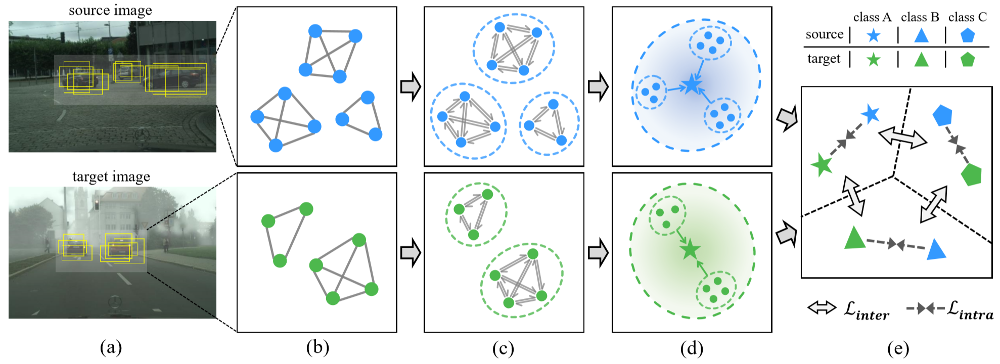

# Cross-domain Detection via Graph-induced Prototype Alignment

<p align="center">
   
</p>

## Introduction

This project is an implementation of ``Cross-domain Detection via Graph-induced Prototype Alignment'' in PyTorch, which is accepted by CVPR 2020. 
We would like to appreciate for the excellent work of [jwyang/faster-rcnn.pytorch](https://github.com/jwyang/faster-rcnn.pytorch) which lays a solid foundation for our work.

More details of this work can be found in our paper: [[Paper (arxiv)]](https://arxiv.org/abs/2003.12849).

## Preparation

First of all, clone the code
```
git clone https://github.com/ChrisAllenMing/GPA-detection.git
```

Then, create a folder:
```
cd GPA-detection && mkdir data
```

### Prerequisites

* Python 2.7 or 3.6
* Pytorch 0.4.1 
* CUDA 8.0 or higher

### Dataset Preparation

* [Cityscapes & Foggy Cityscapes](https://www.cityscapes-dataset.com/)
   
  p.s. Transform original segmentation annotations to detection formats using these [codes](https://jbox.sjtu.edu.cn/l/KnHCR2).
* [SIM 10k](https://fcav.engin.umich.edu/projects/driving-in-the-matrix)
* [KITTI](http://www.cvlibs.net/datasets/kitti/eval_object.php?obj_benchmark=2d)

### Pretrained Model

In all experiments, we use a ResNet-50 model pretrained on ImageNet as the backbone. You can download this model from:

* ResNet-50: [Jbox](https://jbox.sjtu.edu.cn/l/H1Nwdz)

This model should be put into ./data/pretrained_model/.

**NOTE**. We experimentally found that the Caffe pretrained model outperforms the PyTorch pretrained one. 
If you would like to evaluate our method with other backbones, a converted model from Caffe to PyTorch maybe favored.

### Compilation

Install all the python dependencies using pip:
```
pip install -r requirements.txt
```

Compile the cuda depended modules, e.g. NMS, ROI Pooling, ROI Align and ROI Crop, using following simple commands:

```
cd lib
sh make.sh
```

Some issues about compilation can be found [here](https://github.com/jwyang/faster-rcnn.pytorch/issues).

## Training

To train the Faster R-CNN baseline, simply run:
```
CUDA_VISIBLE_DEVICES=$GPU_ID python train_baseline.py --dataset sim10k \
                    --model_config baseline --net res50 --bs 3 --nw 1 \
                    --epochs 10 --lr 0.001 --lr_decay_step 6 \
                    --lr_decay_gamma 0.1 --cuda
```

To train the proposed model ***without graph-based aggregation***, simply run:
```
CUDA_VISIBLE_DEVICES=$GPU_ID python train_GPA.py --dataset sim10k \
                    --tgt_dataset city --model_config adapt --mode adapt \
                    --rpn_mode adapt --net res50 --bs 3 --nw 1 --epochs 10 \
                    --lr 0.001 --lr_decay_step 6 --lr_decay_gamma 0.1 \
                    --warm_up 200 --da_weight 1.0 --rpn_da_weight 1.0 --cuda 
```
To train the proposed model ***with graph-based aggregation***, simply run:
```
CUDA_VISIBLE_DEVICES=$GPU_ID python train_GPA.py --dataset sim10k \
                    --tgt_dataset city --model_config gcn_adapt \
                    --mode gcn_adapt --rpn_mode gcn_adapt --net res50 --bs 3 \
                    --nw 1 --epochs 10 --lr 0.001 --lr_decay_step 6 \
                    --lr_decay_gamma 0.1 --warm_up 200 --da_weight 1.0 \
                    --rpn_da_weight 1.0 --cuda 
```
In our experiments, we train the model with two GPUs as follows:
```
CUDA_VISIBLE_DEVICES=$GPU_IDs python train_GPA.py --dataset sim10k \
                    --tgt_dataset city --model_config gcn_adapt_multi \
                    --mode gcn_adapt --rpn_mode gcn_adapt --net res50 --bs 6 \
                    --nw 2 --epochs 10 --lr 0.001 --lr_decay_step 6 \
                    --lr_decay_gamma 0.1 --warm_up 200 --da_weight 1.0 \
                    --rpn_da_weight 1.0 --cuda --mGPUs
```

## Test

In order to test the model of every epoch, for the baseline, you can run:
```
python iterative_test.py --dataset city --model_config baseline --net res50 \
                        --checksession $session_num --checkpoint $iter_num \
                        --start_epoch 1 --end_epoch 10 --gpu_id $GPU_ID \
                        --test_mode baseline --cuda
```
To evaluate the proposed GPA model, you can run:
```
python iterative_test.py --dataset city --model_config gcn_adapt --net res50 \
                        --checksession $session_num --checkpoint $iter_num \
                        --start_epoch 1 --end_epoch 10 --gpu_id $GPU_ID \
                        --test_mode GPA --cuda
```
## Citation


If this work helps your research, please cite the following paper.
```
inproceedings{xu2020cross-domain,
  author={Minghao Xu and Hang Wang and Bingbing Ni and Qi Tian and Wenjun Zhang},
  title={Cross-domain Detection via Graph-induced Prototype Alignment},
  booktitle={{IEEE} Conference on Computer Vision and Pattern Recognition},
  pages={12355-12364},
  year={2020}
}
```